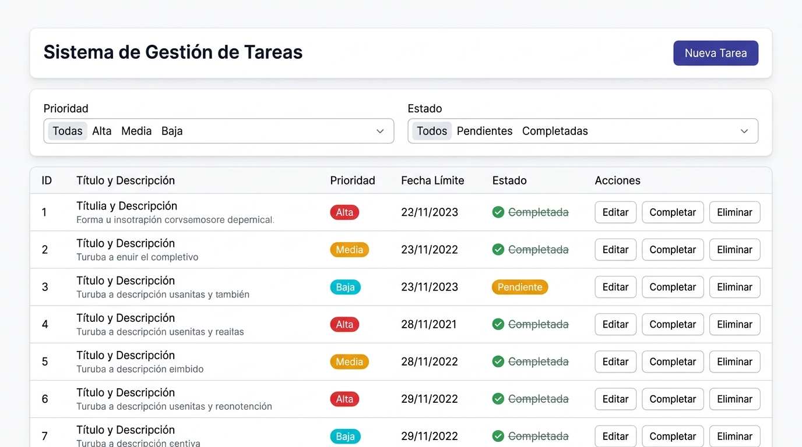
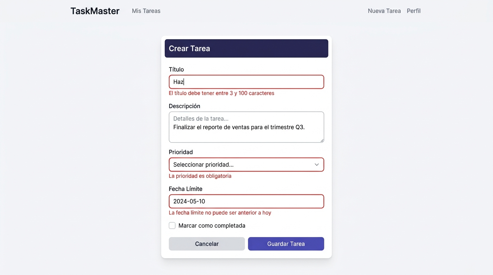
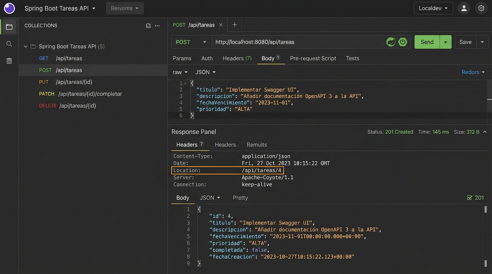

# Post-contenido — Unidad 7: Gestión de Tareas con Spring Boot (Thymeleaf y API REST)

**Autor:** Dallos  
**Tecnologías:** Java 17 | Spring Boot 3.2.3 | Spring MVC & REST | Thymeleaf | Jakarta Bean Validation | Maven  
**Repositorio:** `dallos-post1-u7`  

---

## 📌 Descripción del Proyecto

Este proyecto implementa una solución empresarial completa y desacoplada para la **Gestión de Tareas**, aplicando la arquitectura en capas sobre el framework **Spring Boot 3.2**. El sistema integra de manera simultánea dos capas de presentación sobre el mismo servicio de dominio en memoria:

1. **Capa Web MVC basada en Servidor:** Renderizada dinámicamente con **Thymeleaf**, formularios con validación reactiva y aplicación estricta del patrón **PRG (Post-Redirect-Get)**.
2. **API RESTful:** Endpoints semánticos conformes a HTTP/1.1 (GET, POST, PUT, PATCH, DELETE) con control de cabeceras (`Location`), códigos de estado estándar (200, 201, 204, 400, 404) y manejo centralizado de errores mediante `@RestControllerAdvice`.

---

## 🧱 Estructura del Proyecto

```text
dallos-post1-u7/
├── pom.xml
├── README.md
├── .gitignore
├── capturas/
│   ├── 01_lista_tareas.jpg
│   ├── 02_formulario_errores.jpg
│   └── 03_api_rest_post_201.jpg
└── src/
    ├── main/
    │   ├── java/com/universidad/tareas/
    │   │   ├── TareasApplication.java
    │   │   ├── model/
    │   │   │   ├── Prioridad.java
    │   │   │   └── Tarea.java
    │   │   ├── service/
    │   │   │   └── TareaService.java
    │   │   └── controller/
    │   │       ├── TareaController.java
    │   │       ├── TareaApiController.java
    │   │       └── ApiErrorHandler.java
    │   └── resources/
    │       ├── application.properties
    │       └── templates/tareas/
    │           ├── lista.html
    │           └── formulario.html
    └── test/
        └── java/com/universidad/tareas/
            ├── service/
            │   └── TareaServiceTest.java
            └── controller/
                ├── TareaControllerTest.java
                └── TareaApiControllerTest.java
```

---

## ⚙️ Configuración y Prerrequisitos

### Prerrequisitos
- **JDK:** Java 17 o superior.
- **Maven:** Apache Maven 3.8+ (o wrapper).
- **Puerto de red:** `8080` disponible en el sistema.

### Configuración de la aplicación (`src/main/resources/application.properties`)
```properties
server.port=8080
spring.application.name=gestion-tareas
spring.thymeleaf.cache=false
logging.level.com.universidad=DEBUG
```

---

## 🚀 Compilación y Ejecución

### 1. Ejecutar la suite de pruebas automatizadas (24 pruebas)
```bash
mvn clean test
```

### 2. Iniciar la aplicación
```bash
mvn spring-boot:run
```

La aplicación quedará disponible en:
- **Vista Web Thymeleaf:** [http://localhost:8080/tareas](http://localhost:8080/tareas)
- **API REST Base:** [http://localhost:8080/api/tareas](http://localhost:8080/api/tareas)

---

## 📋 Resumen Técnico de Componentes

### Parte 1 — Capa Web MVC con Thymeleaf (`TareaController`)
- **Anotaciones:** `@Controller`, `@RequestMapping("/tareas")`.
- **Inyección por Constructor:** Inyección obligatoria de `TareaService` sin recurrir a `@Autowired` en atributos de instancia.
- **Filtros Dinámicos:** Lectura de `@RequestParam(required = false) Prioridad prioridad` y `@RequestParam(required = false) Boolean completada` con envío automático del formulario mediante evento `onchange="this.form.submit()"`.
- **Validación con Bean Validation:** Evaluación con `@Valid @ModelAttribute("tarea") Tarea tarea` y `BindingResult`. En caso de errores, se recarga la vista `tareas/formulario` sin redirección preservando los mensajes contextuales; si es válido, se persiste y se aplica el patrón **PRG** (`redirect:/tareas`).
- **Peticiones Seguras (POST):** Las operaciones de marcado (`POST /tareas/{id}/completar`) y eliminación (`POST /tareas/{id}/eliminar`) se ejecutan mediante formularios POST para evitar mutaciones accidentales por métodos GET.

### Parte 2 — API REST y Manejo Global de Errores (`TareaApiController`)
- **Anotaciones:** `@RestController`, `@RequestMapping("/api/tareas")`.
- **Endpoints Semánticos:**
  - `GET /api/tareas`: Retorna lista filtrada de tareas con código `200 OK`.
  - `GET /api/tareas/{id}`: Retorna tarea con código `200 OK` o `404 Not Found`.
  - `POST /api/tareas`: Validación JSON con `@Valid @RequestBody`. Retorna código `201 Created`, cabecera `Location: /api/tareas/{id}` y el recurso creado.
  - `PUT /api/tareas/{id}`: Reemplazo completo del recurso con código `200 OK` o `404 Not Found`.
  - `PATCH /api/tareas/{id}/completar`: Modificación parcial del estado con código `200 OK` o `404 Not Found`.
  - `DELETE /api/tareas/{id}`: Eliminación física con código `204 No Content` o `404 Not Found`.
- **Manejo Centralizado de Excepciones (`ApiErrorHandler`):**
  - Implementa `@RestControllerAdvice(assignableTypes = {TareaApiController.class})`.
  - Intercepta `MethodArgumentNotValidException` producida por Bean Validation y transforma los errores en un mapa asociativo `{ "campo": "mensaje" }` retornando `400 Bad Request`.

---

## 🌐 Tabla de Endpoints de la API REST

| Método HTTP | Endpoint URI | Códigos de Respuesta | Descripción | Cuerpo / Parámetros |
|:---|:---|:---|:---|:---|
| **GET** | `/api/tareas` | `200 OK` | Obtiene la lista de tareas (soporta filtros opcionales). | Query params: `prioridad` *(ALTA, MEDIA, BAJA)*, `completada` *(true, false)* |
| **GET** | `/api/tareas/{id}` | `200 OK`, `404 Not Found` | Obtiene una tarea específica por su ID. | Path variable: `id` |
| **POST** | `/api/tareas` | `201 Created`, `400 Bad Request` | Crea una nueva tarea validando sus atributos. Retorna cabecera `Location`. | Request Body (JSON con `titulo`, `descripcion`, `prioridad`, `fechaLimite`) |
| **PUT** | `/api/tareas/{id}` | `200 OK`, `400 Bad Request`, `404 Not Found` | Reemplaza completamente los datos de una tarea existente. | Path variable: `id` + Request Body (JSON completo) |
| **PATCH** | `/api/tareas/{id}/completar` | `200 OK`, `404 Not Found` | Modificación parcial: marca la tarea como `completada: true`. | Path variable: `id` |
| **DELETE** | `/api/tareas/{id}` | `204 No Content`, `404 Not Found` | Elimina una tarea por su identificador. | Path variable: `id` |

---

## 💡 Decisiones de Diseño

Las siguientes decisiones de arquitectura fueron aplicadas con rigor en la solución técnica:

### 1. Inyección por constructor en ambos controladores
Se evitó el uso de anotaciones `@Autowired` sobre campos privados (field injection). La inyección explícita mediante el constructor de `TareaController` y `TareaApiController`:
- Garantiza la inmutabilidad de la dependencia (`private final TareaService`).
- Facilita la creación de pruebas unitarias puras y con MockMvc sin necesidad de instanciar un contexto pesado de Spring.
- Elimina el riesgo de referencias nulas (`NullPointerException`) durante la inicialización.

### 2. Uso de `@FutureOrPresent` vs `@Future` en `fechaLimite`
Se seleccionó `@FutureOrPresent(message = "La fecha límite no puede ser anterior a hoy")` en lugar de `@Future`:
- En aplicaciones de gestión operativa, es un caso de uso común registrar compromisos y tareas con vencimiento en el transcurso de la misma jornada laboral (hoy).
- La anotación `@Future` impediría registrar tareas para la fecha actual, obligando a los usuarios a registrar fechas futuras exclusivamente.

### 3. Uso de formularios POST (no GET) para completar y eliminar
Siguiendo las especificaciones de HTTP/1.1 y las directrices de seguridad web:
- Las peticiones **GET** deben ser seguras e idempotentes (sin efectos secundarios en el estado del servidor).
- Utilizar enlaces `GET` para eliminar o completar tareas expone al sistema a ejecuciones destructivas por indexadores de motores de búsqueda, precarga de navegadores (*prefetching*) y ataques CSRF.
- Por tanto, se implementaron `<form th:action="..." method="post">` con confirmación JavaScript previa en la acción de eliminar.

### 4. Uso de PATCH para completar vs PUT para reemplazo
- **`PUT /api/tareas/{id}`:** Representa una sustitución completa y canónica del recurso. Exige que el cliente suministre el payload integral de la entidad.
- **`PATCH /api/tareas/{id}/completar`:** Representa una mutación parcial que modifica únicamente el campo booleano `completada`, ahorrando ancho de banda y protegiendo el resto de los campos de sobreescrituras accidentales.

### 5. Manejo dual de validación por capa (Thymeleaf vs REST)
- **Capa Web MVC (`TareaController`):** Consume `BindingResult` directamente en la firma del método para capturar errores de formulario, agregando los datos contextuales al `Model` y re-renderizando la plantilla `tareas/formulario` para mostrar los mensajes de error en línea junto a cada `<input>`.
- **Capa API REST (`TareaApiController` y `ApiErrorHandler`):** No utiliza `BindingResult` en el controlador para delegar la intercepción a `@RestControllerAdvice`, transformando la excepción `MethodArgumentNotValidException` en una respuesta JSON estructurada con código `400 Bad Request` y formato `{ "campo": "mensaje" }`.

### 6. Persistencia temporal en memoria con Map en `TareaService`
- Se utilizó una estructura en memoria `Map<Long, Tarea> tareas = new LinkedHashMap<>()` y un contador secuencial de ID.
- Al ser `TareaService` un componente singleton gestionado por Spring (`@Service`), ambas capas (Thymeleaf y REST) operan simultáneamente sobre la misma fuente de verdad en memoria, satisfaciendo el alcance de la unidad sin introducir la sobrecarga de JPA/Hibernate.

---

## 📸 Evidencias y Capturas de Pantalla

Las capturas de funcionamiento se encuentran alojadas en la carpeta [`/capturas`](./capturas):

### 1. Vista Principal de Tareas (Thymeleaf)
Tabla interactiva con filtros de estado y prioridad, badges visuales y listado de tareas:


### 2. Formulario y Validación con Bean Validation
Formulario con validación en servidor y presentación de errores contextuales por campo:


### 3. API REST: Creación (201 Created & Header Location)
Petición POST a la API REST verificando el código 201 Created y la cabecera Location asignada:


---

## 🧪 Cobertura de Pruebas Automatizadas

El proyecto incluye 24 pruebas automatizadas distribuidas en:
- `TareaServiceTest`: Validación de lógica de negocio, filtros combinados, operaciones CRUD y modificaciones de estado.
- `TareaControllerTest`: Validación de rutas MVC, bindings de Thymeleaf, modelo de datos, recarga por errores y patrón PRG.
- `TareaApiControllerTest`: Validación de contratos RESTful, respuestas 200/201/204/404, cabecera `Location` y respuestas 400 Bad Request con `ApiErrorHandler`.

Ejecución exitosa con Maven:
```text
[INFO] Results:
[INFO] Tests run: 24, Failures: 0, Errors: 0, Skipped: 0
[INFO] BUILD SUCCESS
```